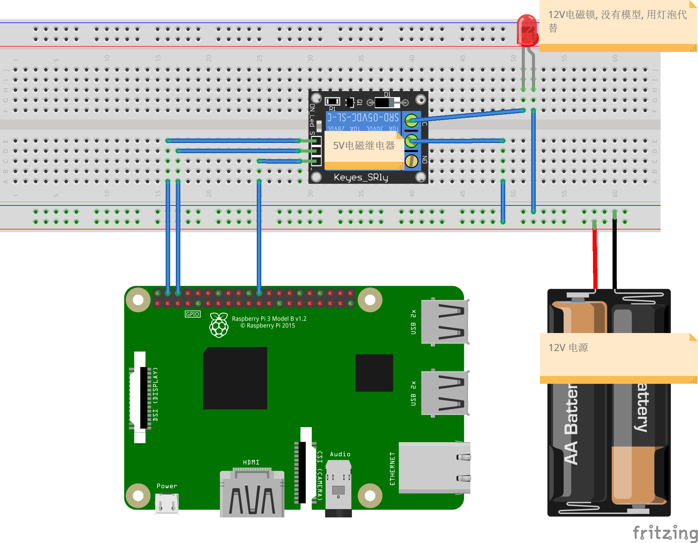

# Facelock
Face recognition control lock

### Power By
* [Face Recognition](https://github.com/ageitgey/face_recognition)
* [Python3.7](https://www.python.org)
* [opencv-python](https://pypi.org/project/opencv-python)
* [gpiozero](https://gpiozero.readthedocs.io/en/stable)
* [Raspbian](https://www.raspberrypi.org/documentation/raspbian)

### Hardware
* [Raspberry Pi 4B](https://www.raspberrypi.org/products/raspberry-pi-4-model-b)
* RTSP Protocol Camera
* Electromagnetic Relay
* Electromagnetic Lock

### Layout



### Run
```
python3 main.py source/ rtsp://IP
```

PS:
Due to the performance reasons of Raspberry Pi, you cannot process pictures in too large format, otherwise the frame reading delay will be caused due to I/O.

Camera parameters
```
Resolution: 640 * 352
FPS: 30
Bit Rate: 512 kbps
```
